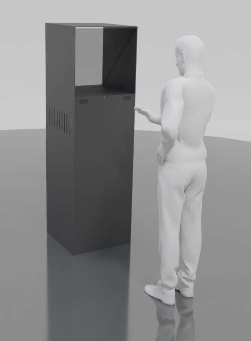

# PGE vizualizér
# Dokumentace

Zařízení PGEV (Pepper’s Ghost Effect Visualizer) je zobrazovací zařízení ve formě výstavního soklu, který umožňuje zobrazovat 
vizuální komponenty multimediálního obsahu na částečně propustném skleněném povrchu. Uživatel tak vidí jak prezentovaný obsah 
tak prostředí za zařízením. Princip systému využívajícího odraz světla od skleněného průhledného povrchu k vizualizaci je 
označován jako Pepperův Ghost efekt a byl využíván už v 19. století na divadelní scéně. Dnes je využit v řadě zařízení pro 
rozšířenou realitu (AR - augmented reality).  

**Tento repozitář obsahuje zdrojové kódy firmwaru PGE.**

Zde popisovaný PGE Vizualizér je určen pro výstavy a expozice v paměťových institucích zejména pro zobrazování 3D objektů a 3D scén 
a je možné na něm zobrazovat i další typy multimediálního obsahu (obrázky, video). PGEV je navržen jako interaktivní zařízení, které 
umožňuje detekovat přítomnost návštěvníka a jeho gesta rukou. Systém vizualizéru rovněž umožňuje jeho propojení s dalšími zařízeními 
tohoto typu a na základě nastavení prezentací je pak možné, aby se tyto prezentace navzájem ovlivňovaly (například synchronizace 
obrazové galerie na jednom zařízení s videem běžícím na jiném zařízení). PGEV je rovněž možné synchronizovat s prezentacemi na 
jiných zařízeních než je PGE. V současné době podmínku kompatibility splňuje Interaktivní projekční stěna 
(IPS, https://github.com/iimcz/ipw-firmware).

## Poznámky k instalaci

nejsou

## Rozcestník dalších komponent dokumentace
- [Dokumentace PGEV](https://github.com/iimcz/pge-box/blob/main/Doc/pgev_dokumentace.pdf)
- [Výrobní dokumentace](https://github.com/iimcz/pge-box/blob/main/Doc/PGEV-model-set-fusion.f3z)
- [Dokumentace zdrojových kódů](https://raw.githubusercontent.com/iimcz/ipw-firmware/master/Doc/EMT_SDK_programatorska_dokumentace.pdf)
- [Protokol o testování IPS](https://github.com/iimcz/pge-box/blob/main/Doc/DCGI-FVZ-01-2022-PTF.pdf)
- Modely pro 3D tisk  - viz Výrobní dokumentace
